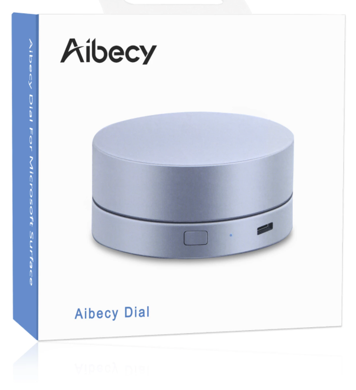

# dial3
`dial3` is a Human Interface Device Controller for macos.

`Target product image`




`Device Information`


```
NSDictionary* criteria = @{
    @kIOHIDDeviceUsagePageKey: @(kHIDPage_GenericDesktop),
    @kIOHIDDeviceUsageKey: @(kHIDUsage_GD_SystemMultiAxisController),
    @kIOHIDVendorIDKey: @(0x1234),
    @kIOHIDProductIDKey: @(0x5678),
};
```

